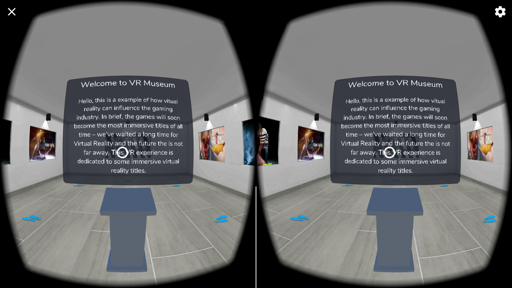
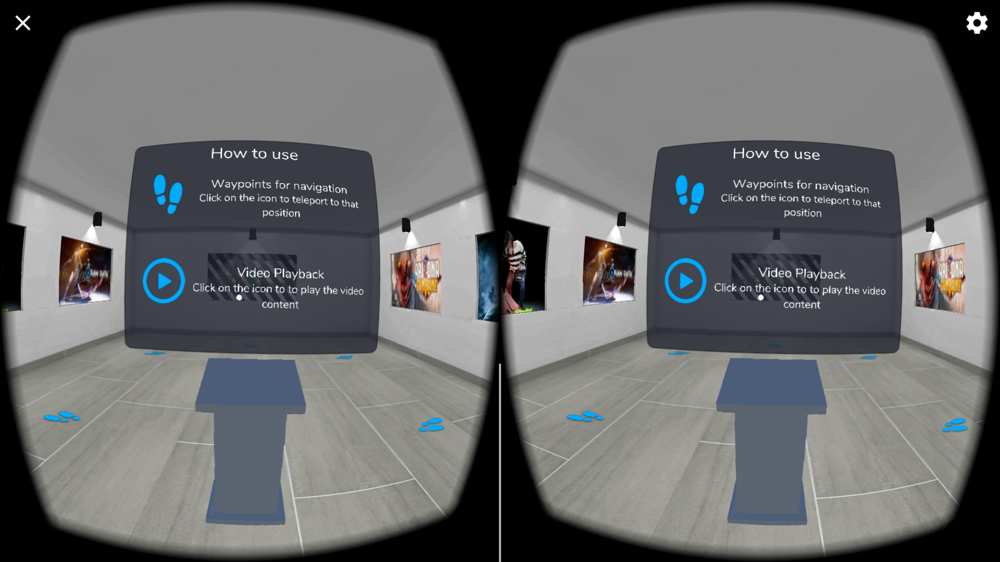
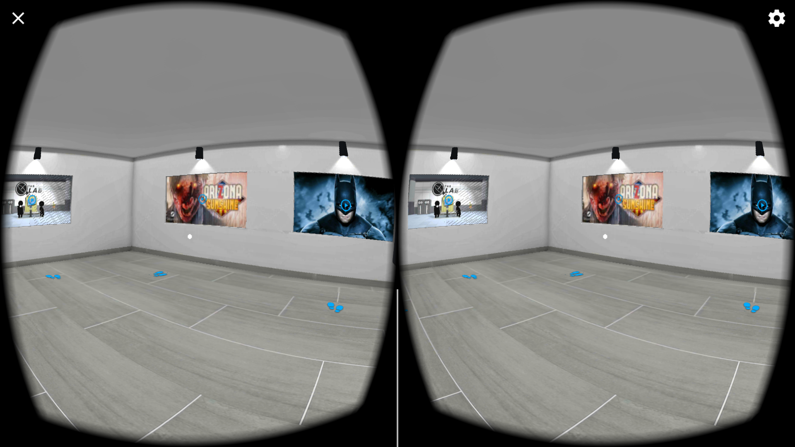
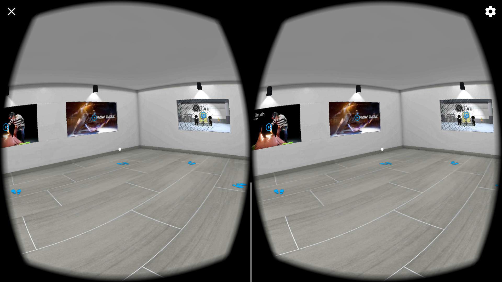
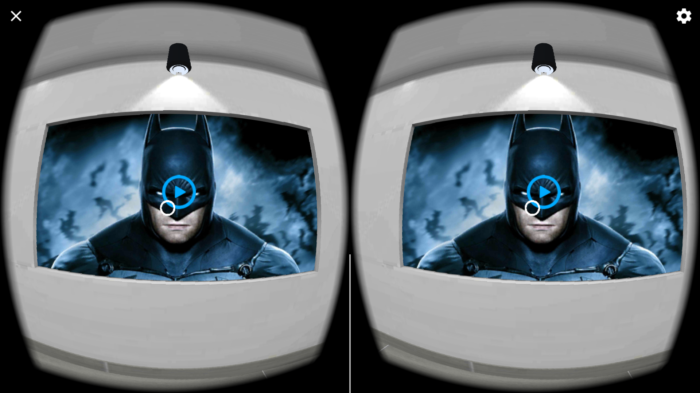
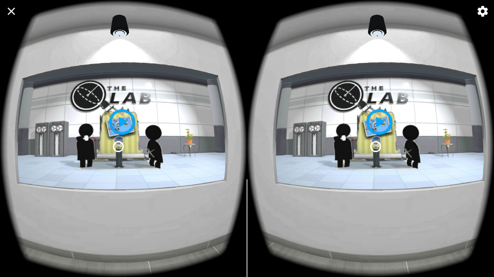
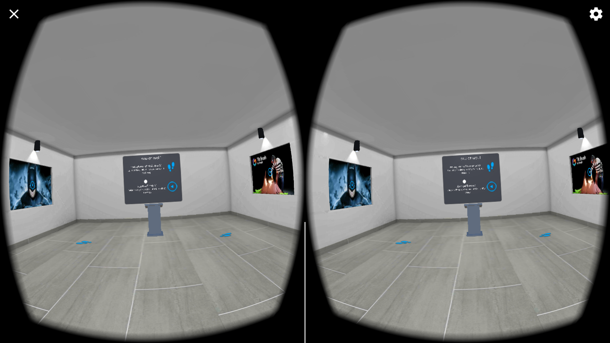

# VR-Museum
A walkthrough of VR influenced games and how gaming industry is gaining popularity.

## Main Features
* Movement is controlled by the waypoints created throughout the environment
* Every can be played via reticle
* Realistic lighting for realism

## Screenshots

## Steps to run project
1. Update to Unity version 5.6 for video support
2. Import Google VR SDK
3. Clone the repository in working directory
4. Open VR-Museum.unity from Scene folder

## Downloads
* Google VR SDK - [ver 1.30](https://github.com/googlevr/gvr-unity-sdk/releases/tag/v1.30.0)
* You can download the apk from [here](https://github.com/manjogsingh/VR-Museum/releases/download/v1.0.0/VR-Museum.apk)

## Author
**Manjog Singh**
* Testing Device - Oneplus 3 (Android Nougat 7.1.1)
* Time taken - 1 week
* Challenging task - To recreate the whole setup
* Best part - The feeling of standing in a virtual realistic environment